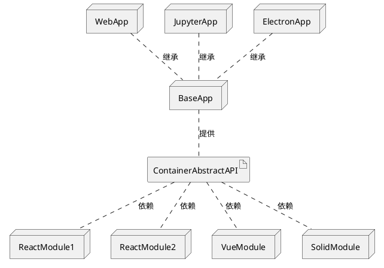

## 概念介绍

本文提供一种用于构建多框架前端项目的思路，目前还尚未完整编写代码验证其可行性。

这种思路有些类似于*微前端*，实际上对于微前端来讲的话，社区已经有了 [single-spa](https://single-spa.js.org/) 和基于其构建的 [qiankun](https://qiankun.umijs.org/zh/guide/tutorial) 等若干方案。

这些框架都很优秀，也经过了不少生产项目的验证，能够在很大程度上满足微前端的需求。

但我个人觉得，对于一个团队规模不是很大，但是又存在不同技术栈的团队来说，直接使用这类微前端框架，会有一些负担，这主要体现在：

1. 各个微前端应用虽然可以互相调用，但是调用方式有限，对于复杂的内容比如通用 UI 模块的共享比较困难。
2. 通常情况下，基座应用不够强大，一定程度上会加剧开发的独立性，不利于代码复用和共享。
3. 原则上，**对于小团队而言，我强烈建议统一成技术栈为 React 或者 Vue，没有任何道理可以支撑同时维护两套技术栈，但是如果想尝试一些新技术栈，可以在初期采用下述方案**。

我提出一种 Container 架构的前端应用，它可能应用在以下几个场景中：

1. 比如你想使用新的框架开发部分模块，例如使用 SolidJS 开发部分 React 项目中的组件，甚至使用 Rust 开发部分模块，用来做项目的实验性尝试。
2. 出于团队人员技术栈的原因，需要 React 和 Vue 混合开发。
3. 新的项目使用了 React，而旧的项目使用了 Vue，并且需要在短时间内把旧的项目放到新的项目中去使用。

Container 架构的主要目的在于：

1. 增强基座项目的重要程度，从而做到尽可能更多地服用基础建设。
2. 不仅模块本身可以用不同的框架编写，基座本身也可以被替换成不同的环境，例如：纯页面环境、定制化的 jupyter 环境、electron 环境。
3. 可以让我们比较方便地进行部分模块先行升级，部分模块使用更高性能的技术栈开发同时尽可能多的复用现有基架。

也就是说，*如果我们想换个语言开发，就新加一个模块就行，如果我们想换个地方运行，就新加一种基座就行*。

从而实现了双向自由度。

同时，它牺牲了一些内容：

1. 模块由于对基座项目的依赖性比较大，通常难以独立部署。

## 核心架构图

核心围绕一套 Container Abstract API 来展开。

真正应用部署的时候，选取一个 App，以及几个对应的 Module，就可以组合出我们的一套需要的项目。

针对这一套架构，对于通用的部分，我们尽可能地实现在 BaseApp 里面。

BaseApp 应该是比较少量的，一个团队中甚至只有一个，它可能会用到一些组件库或者框架，这些都可以的。

## 代码实现

对于这套架构的一个示例代码实现，我会在后续文章中给出。